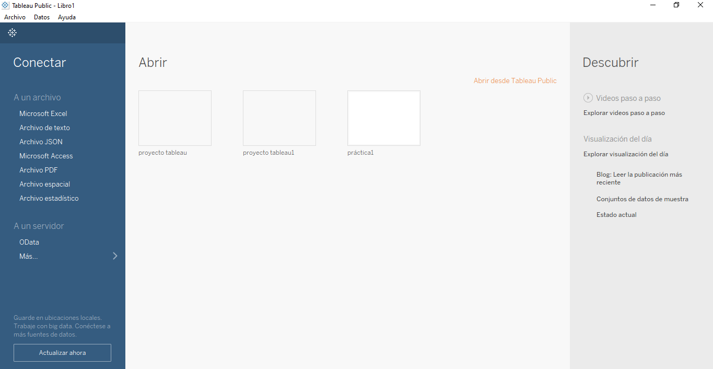
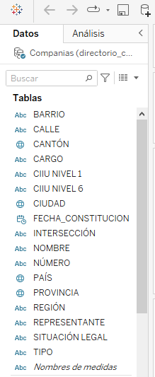
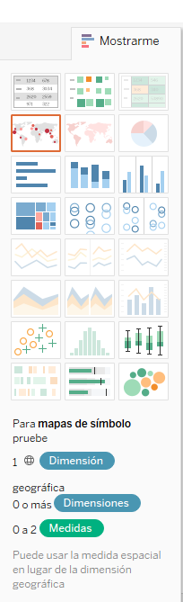
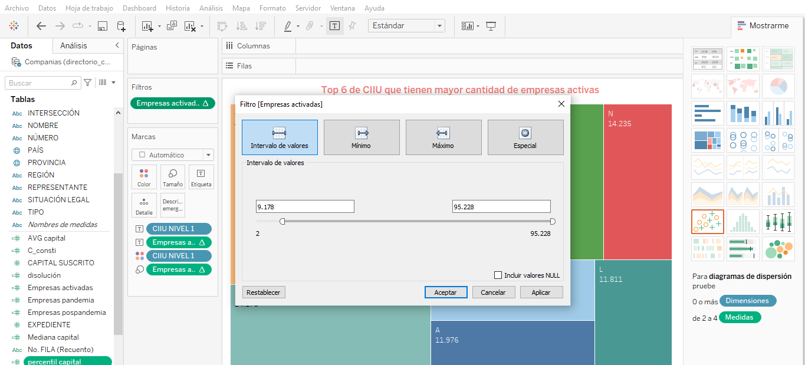
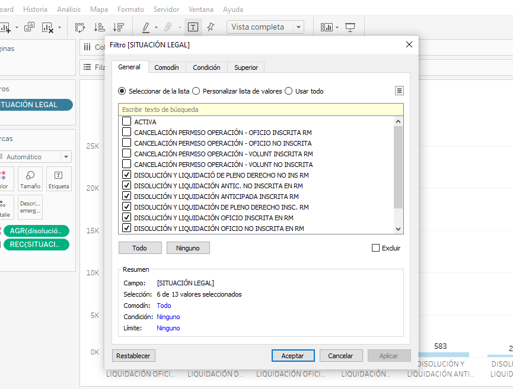
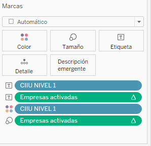

## Introducción

Tableau, una destacada plataforma de visualización y análisis de datos, desempeña un papel esencial en el contexto del directorio de compañías en Ecuador. Esta herramienta permite a las empresas ecuatorianas recopilar datos de diversas fuentes y, a través de visualizaciones interactivas, comprender mejor el tejido empresarial del país. Con Tableau, las organizaciones pueden representar información compleja de manera intuitiva, analizar tendencias a lo largo del tiempo y colaborar de manera efectiva, lo que facilita la toma de decisiones fundamentadas para el directorio de compañías y contribuye al crecimiento y desarrollo empresarial en Ecuador.

Además de su capacidad de visualización, Tableau brinda seguridad y cumplimiento normativo, lo que es fundamental para la gestión de datos sensibles en el directorio de compañías ecuatorianas. Esta plataforma permite proteger la integridad de los datos y garantizar el cumplimiento de regulaciones, promoviendo así un manejo seguro y ético de la información empresarial en el país. En resumen, Tableau ofrece a las empresas en Ecuador una valiosa herramienta para construir, analizar y mantener sus directorios de compañías de manera efectiva, respaldando así la toma de decisiones estratégicas y el crecimiento empresarial en el país.

## Dashboard

Un "dashboard" o un panel de control es una herramienta de visualización de datos que reúne información clave de manera concisa y fácilmente accesible en una única pantalla o interfaz. Estos se utilizan comúnmente en empresas, organizaciones y aplicaciones de software para presentar datos de manera clara y efectiva, lo que facilita la toma de decisiones informadas.

## Manejo básico de Tableau

### Abrir documento de excel

Una vez abierto el programa Tableau, se encontrará con la siguiente imagen en donde se debe realizar varios pasos:

1.  En la parte superior debajo del título ***Conectar y A un archivo,*** seleccione Microsoft excel, debe realizar lo mismo como si estuviese abriendo un documento en el programa de Excel o Word. La lógica es la misma.
2.  Se cargarán la base de datos
3.  Debe arraztrar compañias al interfaz establecer conecciones, más aún si la base de datos tiene más de una hoja de excel.

Ahora, se podrá ir a la hoja de trabajo. Antes de comenzar a realizar las gráficas, se realiza una limpieza a la base de datos en cuanto a formato u otros.

## Mostrarme

La sección **Mostrarme** es una sección poderosa que facilita la exploración y el análisis de datos de manera dinámica. Permite escoger y visualizar ciertos campos y medidas. Al activar esta función, Tableau sugiere automáticamente tipos de gráficos relevantes y transformaciones de datos. Los gráficos se activan conforme cumplan los requerimientos que se detallan en la parte inferior de la imagen.

## Uso del CALCULATE

Una vez hecho, para obtener el total de empresas activas por periodo se procedio:

1.  **Hacer un calculate**: para utilizar la función **`CALCULATE`** permite crear una fórmula calculada en Tableau. Para hacerlo, haz clic con el botón derecho del ratón en el área "Dimensiones" o "Medidas" del lienzo de trabajo y selecciona "Crear campo calculado". Esto abrirá el editor de fórmulas.
2.  **Escribe tu Cálculo con CALCULATE:** En el editor de fórmulas, puedes escribir tu cálculo utilizando la función **`CALCULATE`** junto con otras funciones y campos de datos.

En este caso se requiere conocer el total de empresas activas. En el editor de fórmulas se detalla los códigos:

`{WINDOW_SUM(COUNT([SITUACIÓN LEGAL] = 'ACTIVA'))}`

1.  **`COUNT([SITUACIÓN LEGAL] = 'ACTIVA')`**: Esta parte de la fórmula cuenta las filas donde la columna **`[SITUACIÓN LEGAL]`** tiene el valor 'ACTIVA'. En otras palabras, está contando el número de registros donde la situación legal es 'ACTIVA'. La empresa se encuentra en funcionamiento.

2.  **`{WINDOW_SUM(...)}`**: El resultado del paso anterior se utiliza como entrada para la función **`WINDOW_SUM`**. Esta función se utiliza para realizar un cálculo de suma a lo largo de una ventana o un conjunto de registros. La ventana en este contexto generalmente se refiere a una vista de datos específica, como una tabla de datos en Tableau.

Entonces, en resumen, esta fórmula cuenta cuántas veces aparece 'ACTIVA' en la columna **`[SITUACIÓN LEGAL]`** y luego realiza una suma acumulativa de esa cantidad. El resultado será un valor numérico que representa la suma acumulativa de empresas con situación legal 'ACTIVA' en la ventana de datos en la que se aplica esta fórmula.

Con ello, se obtiene el total de empresas activas hasta la fecha. Además se puede obtener información de cuántas empresas se crearon en la pandemia y despues de esta. Es así que procedemos a realizar otros **`CALCULATE:`**

`SUM( IF [SITUACIÓN LEGAL] = 'Activa' AND [FECHA_CONSTITUCION] >= #2020-02-29# AND [FECHA_CONSTITUCION] <= #2023-05-05# THEN 1 ELSE 0 END)`

Entonces **`SUM(...)`**: Es el comando principal que calcula la suma total de los valores que cumplan con las condiciones especificadas.

1.  **`IF [SITUACIÓN LEGAL] = 'Activa' AND [FECHA_CONSTITUCION] >= #2020-02-29# AND [FECHA_CONSTITUCION] <= #2023-05-05# THEN 1 ELSE 0 END`**: Esta parte es una expresión condicional. Lo que está haciendo es lo siguiente:

    -   Comprueba si la columna **`[SITUACIÓN LEGAL]`** es igual a 'Activa'.

    -   Comprueba si la columna **`[FECHA_CONSTITUCION]`** es igual o posterior al 29 de febrero de 2020 y al mismo tiempo, es igual o anterior al 5 de mayo de 2023.

    -   Si ambas condiciones se cumplen, asigna el valor 1, de lo contrario, asigna el valor 0.El resultado de la expresión condicional es una serie de 1 y 0, donde 1 indica que una fila cumple con todas las condiciones y 0 indica que no las cumple.

Esto significa que suma todos los 1 y 0 según las filas que cumplan o no cumplan las condiciones. El resultado final es la suma total de las filas que cumplen todas las condiciones especificadas.

Lo mismo, se procede para obtener el total de empresas activas pospandemia:

`SUM(IF [SITUACIÓN LEGAL] = 'ACTIVA' AND [FECHA_CONSTITUCION] >= #2023-05-05# THEN 1 ELSE 0 END)`

Para crear un gráfico, arrastra la expresión calculada al estante de filas o columnas en la vista de hoja de trabajo y selecciona el tipo de gráfico que mejor represente tus datos, como barras, líneas o dispersión. Tableau aplicará automáticamente el cálculo a tus datos y generará el gráfico correspondiente." En este contexto, la utilización de un gráfico de barras resulta altamente eficaz para representar los datos, especialmente cuando estos abarcan períodos cortos y presentan variaciones significativas.

Por otro lado para obtener el promedio del capital suscrito de las empresas activas se utiliza un **`CALCULATE`** siguiendo los pasos explicados.

`AVG(IF [SITUACIÓN LEGAL] = 'activa' THEN [CAPITAL SUSCRITO] END)`

El **AVG** permite obtener el promedio de un conjunto de datos.

Esta fórmula calcula el promedio de los valores de "CAPITAL SUSCRITO" únicamente para las empresas o registros que tienen una "SITUACIÓN LEGAL" activa. Los valores que no cumplen con la condición de tener "SITUACIÓN LEGAL" igual a 'activa' se excluyen del cálculo del promedio (Esto se explico en el anterior punto sobre el uso del IF), lo cual permite analizar el promedio del capital suscrito específicamente para las empresas con una situación legal activa en un conjunto de datos.

De igual forma con la mediana que es una medida estadística que se utiliza para encontrar el valor que se encuentra en el centro de un conjunto de datos cuando estos se organizan en orden ascendente o descendente.:

`MEDIAN(IF [SITUACIÓN LEGAL] = 'activa' THEN [CAPITAL SUSCRITO] END)`

Y asi con el quartil

`PERCENTILE([CAPITAL SUSCRITO], 0.2)`

La función **PERCENTILE** toma dos argumentos: el primer argumento es el campo de datos del cual quieres encontrar el percentil, en este caso, "CAPITAL SUSCRITO". El segundo argumento es el percentil que deseas calcular, expresado como un número decimal. En este caso, es 0.2, lo que significa que estás buscando el percentil 20.

## Filtros

Para configurar un filtro en Tableau, primero arrastra la dimensión o medida al estante de filtros, lo que abrirá una ventana emergente de configuración. Aquí, puedes definir los valores que deseas mostrar, elegir entre opciones como lista desplegable o menú de selección múltiple, y personalizar el filtro.

Cabe mencionar que las opciones van a depender de la naturaleza de la variable como se observa en la siguiente gráfica para una númerica:

Se le da un rango para poder obtener un top. En esta parte se utilizó un treeplot, gráficos muy dinámicos que permite visualizar de forma innovadora la información.

En cambio, en una variable cualitativa también podrás seleccionar solo las categorias que se desea analizar en este caso como se muestra a continuación:

## Marcas

Esta sección te permite controlar cómo se visualizan y se representan los datos en un gráfico específico. Es donde tomas decisiones clave sobre la apariencia y el comportamiento de tus datos.

En **Marcas** hay diversas opciones que permite personalizar los gráficos:

**Color:** Controla los colores de las marcas en tu gráfico, es útil para codificar información o categorizar tus datos visualmente por colores.

**Tamaño:** Esta opción permite ajustar el tamaño de las marcas en función de un campo de datos específico para resaltar la importancia o cantidad de datos en cada marca.

**Etiqueta:** Aquí se puede especificar qué campo de datos se utilizará para etiquetar las marcas directamente en la visualización. Esto proporciona información adicional sin necesidad de hacer clic en las marcas.

**Detalle:** Permite agregar campos de datos adicionales que se mostrarán en la descripción emergente cuando pases el cursor sobre una marca. Esto brinda detalles adicionales sin abrumar el gráfico principal.

**Descripción emergente:** Te permite personalizar qué información se muestra cuando se coloca el cursor sobre una marca en el gráfico. Puedes incluir datos específicos y contexto adicional.

## Mapa

Para hacer uso de los mapas debo tener variables geográficas, estas permitirán que Tableau obtengan las coordenadas, seguidamente debo seleccionar en la sección **Mostrarme** el gráfico del mapa.
