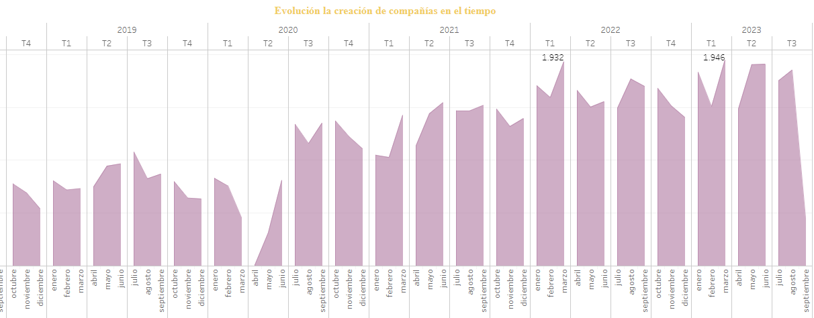

##  **Resumen ejecutivo.**

El Directorio de Compañías de la Superintendencia de Compañías, Valores y Seguros (SCVS) del Ecuador es una base de datos fundamental y pública que contiene información sobre las empresas y organizaciones registradas en Ecuador. La Superintendencia de Compañías es una entidad encargada de regular y supervisar la actividad empresarial, y su directorio es una fuente invaluable de datos para el sector empresarial, el gobierno y otros interesados.

A lo largo de décadas, Ecuador ha experimentado un notable cambio en la dirección de compañías. Desde 1.968, se ha observado un crecimiento constante en la creación de nuevas empresas, alcanzando un punto culminante en 2022 con la incorporación de 19.514 compañías. Esto resalta un ferviente espíritu emprendedor en el país.

Un dato significativo es la distribución temporal de esta actividad. Marzo emergió como el mes estrella para la creación de empresas en los años 2022 y 2023, sugiriendo patrones estacionales o factores desencadenantes específicos en esos momentos.

En el contexto provincial, Guayas lidera en promedio la creación de empresas, con un promedio de 7.724 compañías registradas, seguido de cerca por Pichincha, con 6.020. Esta diferencia en la actividad empresarial entre las provincias es notable y podría estar relacionada con factores geográficos, económicos y demográficos.

Un enfoque adicional revela las actividades comerciales predominantes en estas provincias. Guayas se destaca en el comercio al por mayor y al por menor, así como en la reparación de vehículos automotores y motocicletas. Pichincha, por otro lado, muestra una fuerte presencia en el comercio y reparación de vehículos. Estos datos ofrecen una visión más detallada de las áreas económicas en las que cada provincia se destaca, lo que puede ser esencial para la toma de decisiones empresariales y políticas económicas.

## **Desarrollo**

El presente informe analiza la situación actual y las tendencias en la creación y distribución de empresas en Ecuador,así también, busca comprender mejor la actividad económica y empresarial en el país mediante consultas y análisis específicos en la base de datos de la Superintendencia de Compañías del Ecuador.

Las empresas activas son aquellas que está operando y funcionando en la actualidad. Es decir, es una entidad comercial que está en funcionamiento y que realiza actividades económicas regulares, como la producción, la prestación de servicios o la venta de productos, etc.

A continuación se presenta un gráfico que ilustra el total de empresas activas en diferentes periodos, antes y luego de la pandemia.

.png)

El gráfico 1 presenta la dinámica de creación de empresas en el tiempo. Durante la pandemia, pese que varias compañias cerraron, otras iniciaron su vida comercial, se observa que 51.477 empresas emergieron en la crisis sanitaria, lo que refleja una respuesta empresarial a las circunstancias cambiantes. Sin embargo, tras la pandemia, se registra una marcada disminución, de 7.490 empresas, lo que podría estar relacionado con factores económicos y de mercado. Esta representación visual destaca la volatilidad en la actividad empresarial y cómo los eventos globales pueden tener un impacto en la formación y el cierre de empresas en un corto período de tiempo.

En el gráfico indica el promedio del capital suscrito que es de 167.395. Esto significa que, en promedio, las empresas en el conjunto de datos tienen un capital suscrito de alrededor de 167.395 unidades monetarias. El promedio se calcula sumando todos los valores de capital suscrito y dividiéndolos por el número de empresas.La mediana del capital suscrito es de 800. La mediana es el valor que se encuentra justo en el medio de todos los valores cuando están ordenados de menor a mayor. En este caso, el valor de 800 es el punto medio, lo que sugiere que aproximadamente la mitad de las empresas tienen un capital suscrito por debajo de 800 y la otra mitad por encima de 800. El valor obtenido, que es 400, indica que el 20% de las empresas en el conjunto de datos tienen un capital suscrito igual o inferior a 400 unidades monetarias. Esto proporciona información sobre la distribución de los valores en el conjunto de datos y destaca que un segmento significativo de las empresas tiene un capital suscrito relativamente bajo.

La CIIU "Clasificación Industrial Internacional Uniforme" se compone de una serie de códigos y categorías numéricas que representan diferentes tipos de actividades económicas, como la agricultura, la manufactura, los servicios, la construcción, entre otros. Estos códigos se organizan jerárquicamente en varios niveles, lo que permite una clasificación detallada de las actividades económicas a nivel global.

La gráfica 3 muestra las 6 actividades económicas con mayor empresas activas. En primer lugar, "Comercio al por Mayor y al por Menor; Reparación de Vehículos de Automotores y Motocicletas" (Código G) lidera con 36,327 compañías, lo que subraya la importancia del comercio en el país. En segundo lugar, "Actividades Profesionales, Científicas y Técnicas" (Código M) cuenta con 20,107 empresas activas, indicando una presencia significativa de servicios profesionales y técnicos. El sector de "Transporte y Almacenamiento" (Código H) ocupa el tercer lugar con 15,018 empresas activas, mientras que "Construcción" (Código F) se ubica en el cuarto lugar con 13,988 compañías, destacando la robustez de la industria de la construcción. "Actividades de Servicios Administrativos y de Apoyo" (Código N) se encuentra en el quinto lugar, con 11,081 empresas activas, y "Industrias Manufactureras" (Código C) completa la lista en el sexto lugar, con 9,982 empresas activas. Esta diversidad en las actividades económicas resalta la vitalidad y el potencial de la economía ecuatoriana, brindando oportunidades en varios sectores para el crecimiento empresarial y la inversión. Este análisis muestra una diversidad de actividades económicas activas en Ecuador, con un fuerte énfasis en el comercio, los servicios profesionales, el transporte, la construcción y las industrias manufactureras. Estos sectores desempeñan un papel importante en la economía del país y ofrecen oportunidades para el crecimiento empresarial y la inversión.

La gráfica destaca las provincias de Pichincha y Guayas como líderes en la cantidad de compañías registradas en Ecuador, con 49,000 y 56,692 empresas respectivamente. Pichincha, que incluye la capital Quito, se destaca como un importante centro económico y empresarial, mientras que Guayas, que alberga la ciudad portuaria de Guayaquil, muestra una impresionante concentración de empresas en la región costera del país. Esta ilustración resalta la relevancia económica y comercial de estas dos provincias en la estructura empresarial de Ecuador.

La evolución de la creación de compañías a lo largo del tiempo revela un patrón interesante en el que, en 1902, solo se registró una empresa, marcando un comienzo modesto. Durante las décadas siguientes, la cantidad de empresas aumentó gradualmente pero se mantuvo en niveles bajos, hasta que en 1968 se produjo un punto de inflexión con un total de 110 empresas registradas, indicando un crecimiento significativo en la actividad empresarial. A partir de ese año, la tendencia fue al alza, sugiriendo posibles cambios económicos, regulatorios o de espíritu empresarial. El año 2022 se destacó con un récord de 19.514 empresas registradas, posiblemente debido a factores como oportunidades de mercado, inversiones y políticas gubernamentales que influyeron en la creación de empresas en la región.

En el análisis mensual de la creación de compañías, se observa que los meses de marzo tanto en 2022 como en 2023 destacan como los períodos en los que se crean la mayor cantidad de empresas, con 1.932 y 1.946 empresas registradas, respectivamente. Estos dos puntos altos en marzo sugieren un patrón de actividad empresarial estacional con un fuerte impulso en la creación de empresas durante ese mes en los años mencionados.

En promedio, las actividades comerciales (CIIU) que generan más compañías en Ecuador son aquellas asociadas al sector G, que incluye el comercio al por mayor y al por menor, junto con la reparación de vehículos automotores y motocicletas, con valores notables en Guayas (7.724 empresas) y Pichincha (6.020 empresas). Por otro lado, las actividades relacionadas con la construcción (F) muestran un promedio más bajo en ambas provincias, con 3.724 empresas en Guayas y 3.216 en Pichincha. Estos datos resaltan la importancia de estos sectores en la creación de empresas y ofrecen una visión de las dinámicas empresariales en el país.

En Ecuador las sociedades anónimas son el tipo de empresa más común hasta la fecha, con un total de 101.572 registros, seguidas por las sociedades de responsabilidad limitada, que cuentan con 46.225 registros. Las Sociedades por Acciones Simplificadas (SAS) son menos comunes en comparación con las otras dos categorías, con un total de 43.968 registros. Por último, las sociedades anónimas multinacionales andinas son la categoría menos común, con solo 11 registros. Estos números sugieren que las empresas de estructura anónima y de responsabilidad limitada son las opciones más preferidas en Ecuador, mientras que las SAS y las multinacionales andinas tienen una presencia más limitada en el mercado empresarial del país.

La evolución del tipo de empresa más común en Ecuador, muestran un patrón interesante. A lo largo de los años, se observa un aumento constante en el número de sociedades anónimas registradas. En 1974, estas empresas superaron las 100, marcando el comienzo de un crecimiento progresivo. Aunque hay algunas disminuciones en el número de empresas en años posteriores, no son tan frecuentes ni significativas. Sin embargo, en 2019, se alcanzó el pico más alto con 6.244 sociedades anónimas registradas. Luego, en 2023, se observa una disminución pronunciada a 1.385, lo que podría indicar factores económicos, legales o de mercado que influyeron en esta reducción significativa. En general, la tendencia a largo plazo muestra un aumento en la popularidad de las sociedades anónimas en Ecuador, pero con fluctuaciones notables en años más recientes.

En la gráfica observado un total de 40.913 empresas en proceso de disolución en este momento. Estas se dividen en varias categorías, con la mayoría (26.138) en el estado de "disolución y liquidación oficio inscrita en RM", seguidas por "disolución y liquidación de pleno derecho insc. Rm" con 8.325, "disolución y liquidación anticipada inscrita RM" con 620, "disolución y liquidación oficio no inscrita en RM" con 4.972, "disolución y liquidación de pleno derecho no ins RM" con 275 y "disolución y liquidación antic. No inscrita en RM" con 583. Estos datos reflejan una variedad de situaciones en las que las empresas están en proceso de disolución en diferentes estados y condiciones legales.

.png)

Como se analizó anteriormente tanto las provincias de Guayas y Pichincha son aquellas con mayor número de compañias creadas pero tambien destacan como las regiones con la mayor cantidad de empresas en estado de disolución en Ecuador. En Guayas, las actividades comerciales relacionadas con el sector G, que abarca el comercio al por mayor y al por menor, junto con la reparación de vehículos automotores y motocicletas, registran 6.023 empresas en estado de disolución, mientras que en Pichincha, el sector G también lidera con 3.203 empresas en la misma condición. Además, en Guayas, las actividades relacionadas con la agricultura (A) y la construcción (F) presentan 1.969 y 1.676 empresas en estado de disolución, respectivamente, mientras que en Pichincha, las actividades profesionales, científicas y técnicas (M) y el comercio al por mayor y al por menor (C) tienen 1.727 y 903 empresas en esta situación. Esto ofrece una visión importante de las áreas donde las empresas enfrentan mayores dificultades y resaltan la necesidad de comprender las causas detrás de la disolución empresarial en estos sectores.

Finalamente, este análisis integral de las tendencias en la dirección de compañías en Ecuador destaca el continuo crecimiento de la actividad empresarial en el país, con algunos puntos culminantes en años recientes. Además, muestra la variabilidad regional en la creación de empresas y las actividades comerciales predominantes en cada provincia, lo que brinda información valiosa para comprender mejor la dinámica empresarial en Ecuador y orientar futuras estrategias económicas y empresariales.
